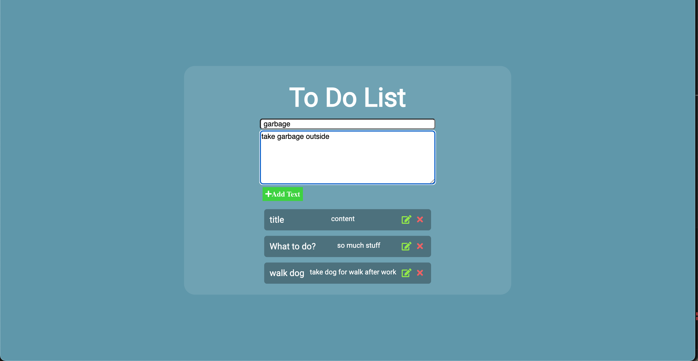
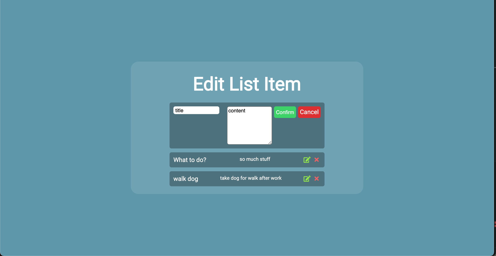

# CRUD ToDo's
ToDo list projcect where you can add, delete and edit todo items.

**Link to project:** Not hosted at this time.

## How It's Made:

**Tech used:** HTML, CSS, JavaScript, Node, and MongoDB. 
**Dependencies used:** cors, dotenv, ejs, express, mongoose.

Made a quick todo app using Node. MongoDB stores the data and I used Mongoose for Schemas. 

## Optimizations

I did not add user authentication to this app yet. If I was going to host it I would clean up some styling and add a login using local auth or Google auth, or maybe both!

## Lessons Learned:

This project was used to practice CRUD and using dependencies.

## To install dependencies run:

`npm install` 
